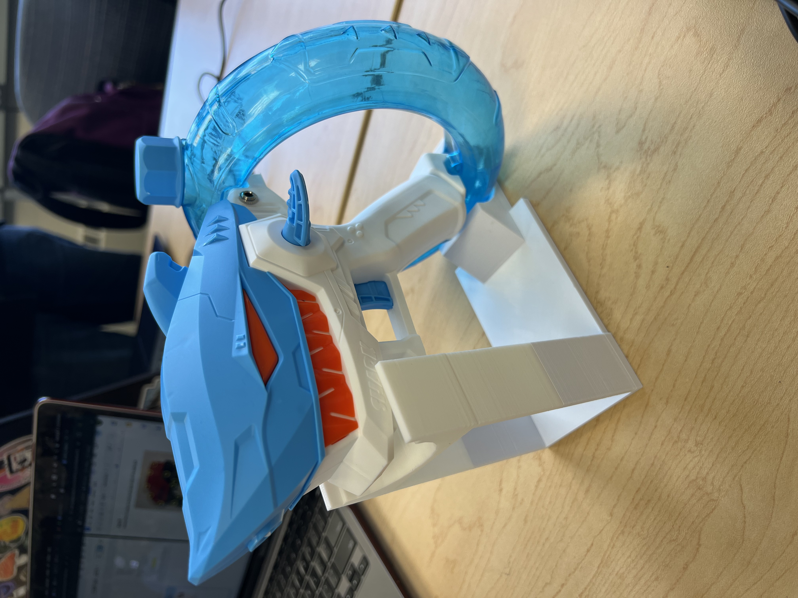

<!--- TITLE --->
# Switch Adapted Water Gun

## Overview
<!--- A brief summary of the project. What it does, who it is for, how much it costs. --->
The Switch Adapted Water Gun is an assistive technology device that allows a 3.5mm assistive switch to trigger the water gun. 

The device is comprised of off-the-shelf parts and 3D printed parts. 

The Switch Adapted Water Gun is open assistive technology (OpenAT). Under the terms of the open source licenses, the device may be built, used, and improved upon by anyone.

The overall cost of materials is about $15.

## How to Obtain the Device
### Do-it-Yourself (DIY) or Do-it-Together (DIT)

This is an open-source assistive technology, so anyone is free to build it. All of the files and instructions required to build the device are contained within this repository. Refer to the Build Instructions below.

## Build Instructions
<!--- Outline the major steps required to create a build --->

### 1. Order the Off-The-Shelf Components

The [Bill of Materials](/Documentation/Switch_Adapted_Water_Gun_BOM.pdf) lists all of the parts and components required to build the device.

### 2. Print the 3D Printable components

All of the files and individual print files can be found in the [/Build_Files/3D_Printing_Files](/Build_Files/3D_Printing_Files/) folder.

Reference the [3D Printing Guide](/Documentation/Switch_Adapted_Water_Gun_3D_Printing_Guide.docx.pdf) for the tools and steps required to print the base.

### 3. Assemble the Water Gun

Reference the [Assembly Guide](/Documentation/Switch_Adapted_Water_Gun_Assembly_Guide.pdf) for the tools and steps required to build the device.

## How to improve this Device
As open source assistive technology, you are welcomed and encouraged to improve upon the design. 

## Files
### Documentation
<!--- Update the name, link, and version for documentation --->
| Document             | Version | Link |
|----------------------|---------|------|
| Design Rationale     | 1.0     | [Switch Adapted_Design_Rationale](/Documentation/Switch_Adapted_Water_Gun_Design_Rationale.pdf)    |
| 3D Printing Guide    | 1.0     | [Switch Adapted Water Gun 3D Printing Guide](/Documentation/Switch_Adapted_Water_Gun_3D_Printing_Guide.docx.pdf)    |
| Assembly Guide       | 1.0     | [Switch Adapted Water Gun Assembly Guide](/Documentation/Switch_Adapted_Water_Gun_Assembly_Guide.pdf)    |
| Bill of Materials    | 1.0     | [Switch Adapted Water Gun_Bill_of_Materials](/Documentation/Switch_Adapted_Water_Gun_BOM.pdf)    |
| User Guide           | 1.0     | [Switch Adapted Water Gun_User_Guide](/Documentation/Switch_Adapted_Water_Gun_User_Guide.pdf)   |
| Maker Checklist      | 1.0     | [Switch Adapted Water Maker Checklist](/Documentation/Switch_Adapted_Water_Gun_Maker_Checklist.pdf)   |

### Design Files
<!--- Include a copy of the original design files to facilitate easy editing and customization. Consider also including a generic format (e.g., STEP) --->
 - [CAD File](/Design_Files/Water_Gun_Base.obj)

### Build Files
<!--- Include a copy of the build files intended for manufacturing. This may include svg files for laser cutting, stl files for 3d printing, Gerber files for custom PCBs, and Arduino files for custom firmware. --->
 - [3D Printing Files](/Build_Files/3D_Printing_Files)

## Attribution
<!--- Provide any necessary attribution for designs or components that are included in the device or as part of the project. --->
The device was designed by Caighley Espardinez, Jake Murakami, Alex Ott, and Kendall Sullivan. 

<!--- This is the attribution for the template. --->
The documentation was written by Caighley Espardinez, Jake Murakami, Alex Ott, and Kendall Sullivan.

### Contributors
<!--- List the names of the people that contributed to the design. This could include the original source of the idea, designers, testers, documenters, etc. --->
Designers:
 - Caighley Espardinez
 - Jake Murakami
 - Alex Ott
 - Kendall Sullivan

Assisted with Soldering and Drilling:
 - Dave Bailey

Outlined and Assisted with Overall Project:
 - Lauren Milne

